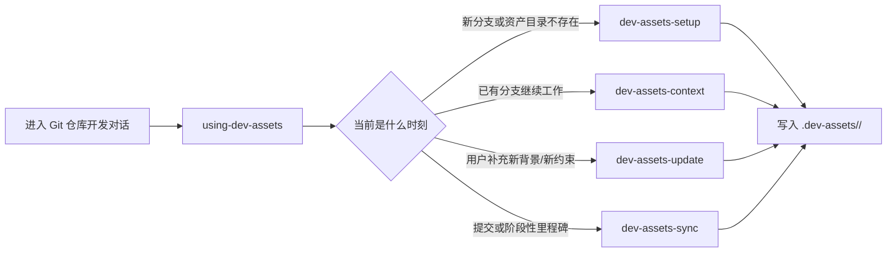

# branch-context-skill-suite 当前目录说明

<callout emoji="🧭" background-color="light-blue">
这份文档面向仓库维护者、二次开发者和准备接手这套 skill suite 的人。结论先说：当前目录承载的不是一组零散提示词，而是一套围绕 Git 分支持续沉淀开发资产的仓库级方案；真正稳定的核心是 `.dev-assets/&lt;branch&gt;/` 这套目录模型，而不是某一个单独 skill。
</callout>

<lark-table header-row="true">
<lark-tr>
<lark-td>

维度

</lark-td>
<lark-td>

当前判断

</lark-td>
<lark-td>

先读哪里

</lark-td>
</lark-tr>
<lark-tr>
<lark-td>

仓库定位

</lark-td>
<lark-td>

一个 branch-scoped development asset skill suite，不是通用脚本仓库

</lark-td>
<lark-td>

`README.md`

</lark-td>
</lark-tr>
<lark-tr>
<lark-td>

核心模型

</lark-td>
<lark-td>

以 `.dev-assets/&lt;branch&gt;/` 为边界，按文档职责沉淀需求、方案、测试、开发过程和提交记录

</lark-td>
<lark-td>

`docs/dev-asset-skill-suite-guide.md`

</lark-td>
</lark-tr>
<lark-tr>
<lark-td>

主工作流

</lark-td>
<lark-td>

`using-dev-assets` 路由到 `setup / context / update / sync`

</lark-td>
<lark-td>

`skills/using-dev-assets/SKILL.md`

</lark-td>
</lark-tr>
<lark-tr>
<lark-td>

主要维护风险

</lark-td>
<lark-td>

命名迁移尚未完全收口，共享逻辑存在复制式分发

</lark-td>
<lark-td>

`suite-manifest.json`、各 skill `scripts/dev_asset_common.py`

</lark-td>
</lark-tr>
</lark-table>

## 这套仓库到底在解决什么问题

这个仓库试图解决的不是“如何给 agent 多装几个 skill”，而是另一个更难但更实际的问题：同一需求在一个 Git 分支上跑了多轮会话之后，PRD、评审结论、技术约束、测试口径和阶段性实现备注，怎样不随着聊天窗口关闭而丢失。

它给出的答案不是数据库，也不是单个索引文件，而是一套按分支隔离、按内容类型分槽位的目录：

```text
.dev-assets/<branch>/
  overview.md
  prd.md
  review-notes.md
  frontend-design.md
  backend-design.md
  test-cases.md
  development.md
  decision-log.md
  commits.md
  manifest.json
  artifacts/
```

因此，理解这个仓库时最关键的一层判断是：skill 只是入口和操作面，真正的系统边界是这套资产目录。

## 当前目录的真实组织方式

如果只按文件夹名看，这里像“`skills + docs + scripts + lib`”。  
如果按职责看，更接近下面四层：

<grid cols="2">
<column width="50">

### 1. 对外入口层

- `README.md`
- `docs/dev-asset-skill-suite-guide.md`
- `suite-manifest.json`

负责告诉第一次接触的人：

- 仓库解决什么问题
- 有哪些 skill
- 怎么安装
- 当前正式名称和兼容旧名称分别是什么

</column>
<column width="50">

### 2. 路由与约束层

- `skills/using-dev-assets/SKILL.md`
- `skills/dev-assets-*/SKILL.md`

负责定义：

- 哪些时机触发哪一个 skill
- 使用顺序是什么
- 哪些动作不能跳过
- 哪些文件应该被读、被写、被同步

</column>
</grid>

<grid cols="2">
<column width="50">

### 3. 脚本执行层

- `skills/dev-assets-setup/scripts/init_dev_assets.py`
- `skills/dev-assets-context/scripts/dev_asset_context.py`
- `skills/dev-assets-update/scripts/dev_asset_update.py`
- `skills/dev-assets-sync/scripts/dev_asset_sync.py`

这一层把 skill 里的行为约束真正变成可执行命令，例如：

- 初始化分支资产目录
- 刷新 `development.md` 自动同步区
- 选择目标文件并追加补充内容
- 记录会话摘要和最新提交
- 安装非阻塞 Git hooks

</column>
<column width="50">

### 4. 共享模型层

- `lib/dev_asset_common.py`
- 各 skill `scripts/dev_asset_common.py`

这里定义了最稳定的公共语义：

- 仓库根目录和当前分支识别
- 分支名清洗和目录解析
- `.dev-assets/` 初始化模板
- `development.md` 自动生成区替换逻辑
- `manifest.json` / `commits.md` 的辅助写入

</column>
</grid>

## 五个 skill 不是并列功能，而是一条工作流



这里有两个容易误判的点：

1. `using-dev-assets` 不是第五种“内容类能力”，而是路由器。
2. `sync` 也不是纯 commit 附属动作，它被设计成“阶段性沉淀点”。

也就是说，这套仓库真正强调的是开发会话的生命周期管理，而不是 skill 数量本身。

## 关键实现细节：哪些地方已经比较稳定

### 1. 资产目录模型已经比较完整

`dev-assets-setup` 会初始化固定文件集合，并顺手做两件工程化动作：

- 把 `dev-assets.dir` 写入本地 Git config
- 把 `.dev-assets/` 加入 `.git/info/exclude`

这说明作者没有把它当作“临时文档目录”，而是当作仓库内的长期辅助层。

### 2. `development.md` 明确区分人工内容和 Git 自动区

`lib/dev_asset_common.py` 里通过 `<!-- AUTO-GENERATED-START -->` / `<!-- AUTO-GENERATED-END -->` 管理自动同步区。  
这意味着：

- 当前需求点、实现备注、风险可以人工持续追加
- Git 派生事实由 `context` 或 `sync` 刷新
- 两类内容不会完全混成流水账

这是整个资产模型里比较成熟的一点，因为它区分了“可编辑叙述”和“可再生事实”。

### 3. `update` 和 `sync` 已经不只是文件写入器

`dev-assets-update` 不是简单把输入 append 到某个文件，而是先按 `kind` 路由到目标文件组。  
`dev-assets-sync` 也不只是记录 SHA，而是支持：

- 会话摘要写入 `overview.md`、`development.md`
- 决策写入 `decision-log.md`
- 前后端和测试信息分别进入专项文档
- 提交记录进入 `commits.md`

这说明仓库作者在尽量避免“所有事情都写进 `development.md`”这种退化路径。

## 当前目录里最值得注意的两个风险

<callout emoji="⚠️" background-color="light-yellow">
如果后面继续维护这套仓库，最该优先处理的不是继续加 skill，而是先解决命名收口和共享逻辑漂移这两个问题。
</callout>

### 风险 1：命名仍处于迁移中

根目录名还是 `branch-context-skill-suite`，但对外文案已经明显切到 `dev-asset-skill-suite`。  
`suite-manifest.json` 同时保留了：

- 正式名称：`using-dev-assets`、`dev-assets-*`
- 兼容旧名称：`branch-context`、`dev-asset-context` 等

这本身不是错误，但它意味着：

- 当前仓库仍有一层历史兼容负担
- 文档、安装说明、目录命名如果不同步，使用者会困惑“到底该搜哪个词”

### 风险 2：共享逻辑是复制式分发，不是单点复用

根目录有 `lib/dev_asset_common.py`，各 skill 的 `scripts/` 下也带着自己的 `dev_asset_common.py`。  
这带来一个直接的维护代价：一旦公共逻辑有 bug 修复或字段调整，需要同步多份副本，否则不同 skill 可能逐步漂移。

它的优点也很明确：skill 自给自足，分发时更稳，不依赖仓库根目录 import 路径。  
但从长期维护看，这是当前仓库最像“技术债”的地方。

## 维护者的推荐阅读顺序

如果现在要接手这套仓库，最省时间的阅读顺序不是先翻所有脚本，而是：

1. 先读 `README.md`，确认对外定位和安装方式。
2. 再读 `docs/dev-asset-skill-suite-guide.md`，建立完整工作流模型。
3. 然后读 `skills/using-dev-assets/SKILL.md`，看路由总规则。
4. 再分别读 `dev-assets-setup / context / update / sync` 的 `SKILL.md`，明确职责边界。
5. 最后再看 `scripts/*.py` 和 `lib/dev_asset_common.py`，验证这些规则如何真正落地。

这个顺序的价值在于：先建立系统边界，再看脚本实现，不容易把这套仓库误读成“若干 Python 工具 + 若干提示词”。

## 如果要继续完善，优先级建议

<lark-table header-row="true">
<lark-tr>
<lark-td>

优先级

</lark-td>
<lark-td>

建议动作

</lark-td>
<lark-td>

原因

</lark-td>
</lark-tr>
<lark-tr>
<lark-td>

P1

</lark-td>
<lark-td>

统一仓库名、README 用词、manifest 正式名和 skill 文案中的主名称

</lark-td>
<lark-td>

先把读者认知收口，否则后续所有扩展都会带着旧名包袱

</lark-td>
</lark-tr>
<lark-tr>
<lark-td>

P2

</lark-td>
<lark-td>

决定 `dev_asset_common.py` 是继续复制式分发，还是引入更稳定的共享策略

</lark-td>
<lark-td>

这是当前最主要的维护成本来源

</lark-td>
</lark-tr>
<lark-tr>
<lark-td>

P3

</lark-td>
<lark-td>

再考虑扩展外部文档、附件、会议纪要等 ingestion 能力

</lark-td>
<lark-td>

功能扩展的价值成立，但前提是基础命名和公共层足够稳定

</lark-td>
</lark-tr>
</lark-table>

## 一句话结论

当前目录已经具备一套自洽的 branch-scoped 开发资产方案，核心工作流和文档槽位设计是清楚的；真正需要继续收敛的，不是“功能缺口”，而是“命名一致性”和“公共逻辑复制带来的维护成本”。
