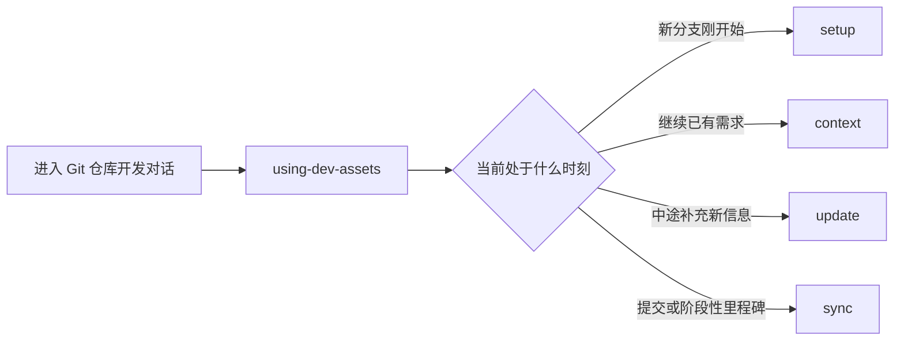

# Dev Asset Skill Suite 对外介绍

<callout emoji="💡" background-color="light-blue">
这套 suite 解决的不是“怎么让 agent 当场回答得更像专家”，而是“同一个需求跨多轮会话、多个提交继续推进时，背景信息怎么不失忆”。
</callout>

<lark-table header-row="true">
<lark-tr>
<lark-td>

如果你当前遇到的是

</lark-td>
<lark-td>

这套 suite 会有帮助

</lark-td>
</lark-tr>
<lark-tr>
<lark-td>

每次继续开发都要重新解释 PRD、评审结论和技术约束

</lark-td>
<lark-td>

它会把这些信息沉淀到 `.dev-assets/&lt;branch&gt;/`，让 agent 下次先恢复上下文

</lark-td>
</lark-tr>
<lark-tr>
<lark-td>

commit 做完了，但为什么这样改、还有哪些风险只留在聊天里

</lark-td>
<lark-td>

它会把阶段性结论、实现备注、风险和提交记录同步进对应资产文件

</lark-td>
</lark-tr>
<lark-tr>
<lark-td>

需求要跑很多轮，但你不想靠会话历史硬撑上下文

</lark-td>
<lark-td>

它把“可复用背景”从聊天记录里拆出来，变成分支级开发资产

</lark-td>
</lark-tr>
</lark-table>

## 它到底是什么

`Dev Asset Skill Suite` 是一套围绕 Git 分支工作的 skill suite。  
它默认每个正在推进的需求都对应一个分支，并在仓库里维护一套：

```text
.dev-assets/<branch>/
  overview.md
  prd.md
  review-notes.md
  frontend-design.md
  backend-design.md
  test-cases.md
  development.md
  decision-log.md
  commits.md
  manifest.json
  artifacts/
```

这套目录不是“顺手记点笔记”，而是把几类会反复用到的信息固定沉淀下来：

- 需求目标和范围
- 评审结论与争议点
- 前后端方案约束
- 测试口径和边界场景
- 当前实现备注、风险、后续事项
- 提交记录和阶段性决策

## 它怎么工作

整套能力可以理解成 1 个入口 + 4 个动作：

<grid cols="2">
<column width="50">

### 入口

`using-dev-assets`

负责判断当前对话应该先做哪一步，而不是直接改代码或直接问细节。

</column>
<column width="50">

### 四个动作

- `dev-assets-setup`
- `dev-assets-context`
- `dev-assets-update`
- `dev-assets-sync`

</column>
</grid>



这四个动作分别处理四类高频场景：

- `setup`：为新分支建立资产目录和资料槽位
- `context`：继续开发前先恢复当前分支已经沉淀的背景
- `update`：把新出现的约束、结论、测试口径写到正确文件
- `sync`：在 commit 或阶段节点同步会话摘要、风险和提交记录

## 它适合什么场景，不适合什么场景

<lark-table header-row="true">
<lark-tr>
<lark-td>

更适合

</lark-td>
<lark-td>

不太适合

</lark-td>
</lark-tr>
<lark-tr>
<lark-td>

一个分支会持续推进同一个需求，信息会跨多个回合反复引用

</lark-td>
<lark-td>

一个分支长期混着多个无关任务，分支本身不代表稳定上下文

</lark-td>
</lark-tr>
<lark-tr>
<lark-td>

你希望 agent 在开始工作前先恢复背景，而不是直接盲看代码

</lark-td>
<lark-td>

你只需要一次性聊天，不在意后续继续开发时的信息复用

</lark-td>
</lark-tr>
<lark-tr>
<lark-td>

你愿意在仓库里维护 `.dev-assets/` 这层辅助资产

</lark-td>
<lark-td>

你希望所有背景都只留在外部文档系统，不进入仓库本地上下文

</lark-td>
</lark-tr>
</lark-table>

因此，它最适合的用户不是“只想装更多 skill 的人”，而是“确实被长分支、多轮会话的上下文丢失问题拖慢过的人”。

## 它和 README、会议纪要、单次 Prompt 的差别

README 更偏静态介绍，会议纪要更像一次性记录，单次 Prompt 则只服务当前这轮对话。  
这套 suite 的重点是持续维护一份分支级上下文：

- 开始工作前先恢复
- 中途出现新信息就补录
- 阶段完成时顺手同步

所以它不是“整理资料的模板”，而是“开发过程中的上下文基础设施”。

## 对使用者最直接的价值

<grid cols="2">
<column width="50">

### 你会得到什么

- 继续已有需求时，不必每次从头讲背景
- 评审结论、约束、风险不容易只散落在聊天历史里
- agent 更容易知道先看什么，再决定是否读代码
- commit 之外还能保留阶段性结论和实现理由

</column>
<column width="50">

### 你需要接受什么前提

- 它依赖 Git 分支作为上下文边界
- 资料质量取决于是否持续补录，而不是初始化一次就结束
- 它擅长文本与结构化背景，不是多媒体资产管理系统
- 如果团队分支习惯很乱，这套模型效果会明显下降

</column>
</grid>

## 安装方式

查看仓库中的可用技能：

```bash
npx skills add xluos/dev-asset-skill-suite --list
```

为 Codex 全局安装整套技能：

```bash
npx skills add xluos/dev-asset-skill-suite --skill '*' -a codex -g -y
```

为所有已检测到的 agent 安装整套技能：

```bash
npx skills add xluos/dev-asset-skill-suite --all -g -y
```

## 一句话判断值不值得装

<callout emoji="🧭" background-color="light-green">
如果你要解决的是“这一轮回答怎么更好”，它不是重点；如果你要解决的是“同一个需求跨多轮开发怎么不失忆”，它才真正有价值。
</callout>
